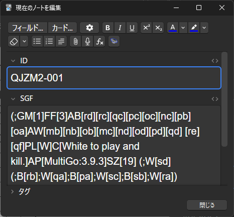
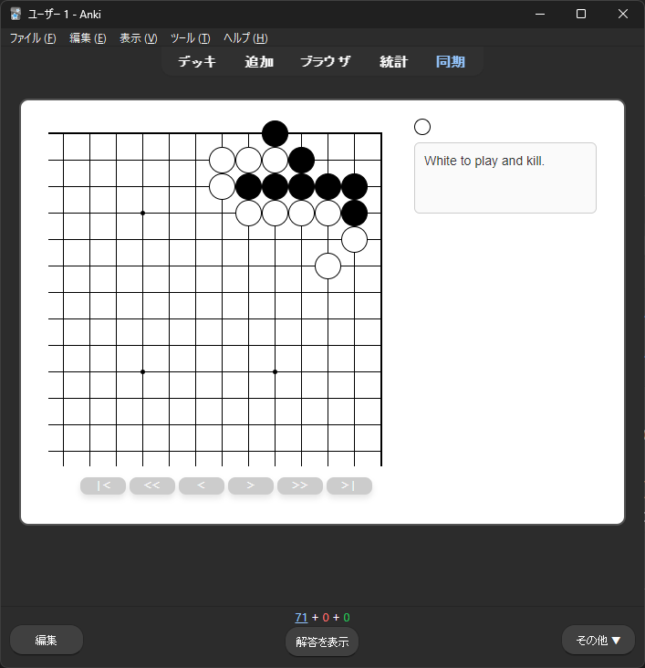
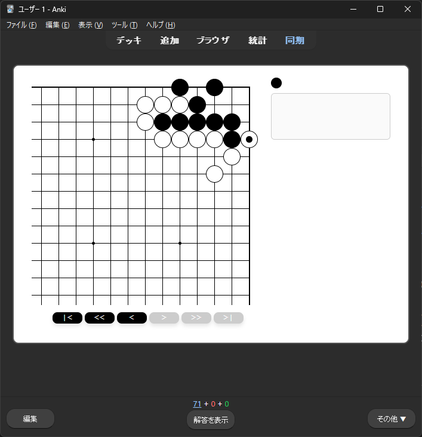
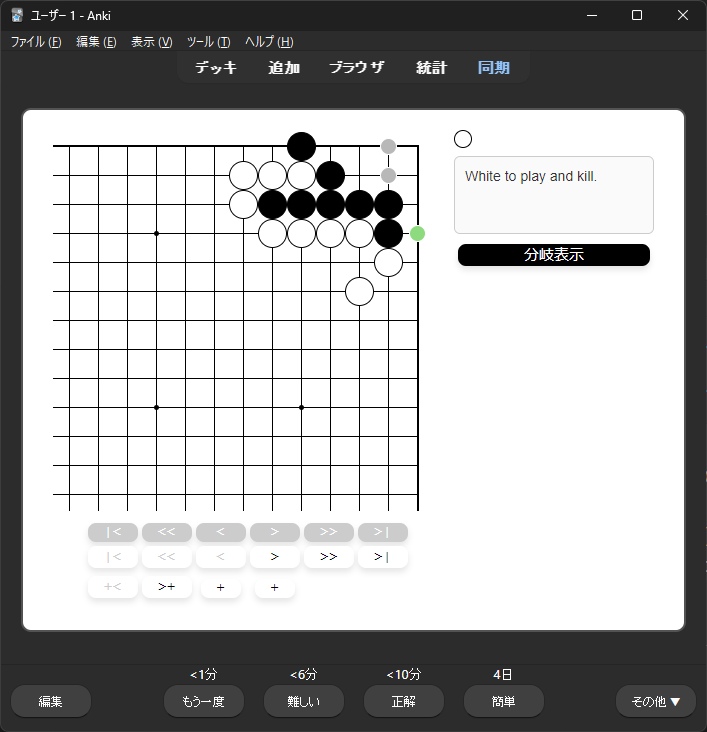

# anki-go-tmplate

[日本語](README.md) | **English**

An Anki card template for studying Go (baduk/weiqi) problems. Paste an SGF into the card field to get an interactive card — rendering the initial position, trying moves, and reviewing variations.

## Features

Paste an SGF into the card field.



The initial position is rendered.



Click the board to try moves.



Show the answer to display SGF variations.



## Try the Sample Deck

Download the sample `.apkg` from [Releases](../../releases/latest) and import it into Anki.

---

## Build & Setup

Nim is transpiled to JS and embedded into Anki's HTML card template.

```
src/ (Nim)
  └─ nim js → dist/front.html (JS embedded)
               dist/back.html
               dist/style.css
```

### Build Commands

| Command | Description |
|---|---|
| `nim dev` | Development build (outputs to `dist-dev/`, viewable in browser) |
| `nim release` | Anki build (outputs JS-embedded HTML to `dist/`) |

### Scripts

**`scripts/setup_model.py`** — Registers the "Go Problem" note type in Anki via AnkiConnect, using the HTML/CSS from `dist/` as the card template.

**`scripts/import_cards.py`** — Recursively scans `sgf/` and imports SGF files as cards. The directory structure under `sgf/` maps to Anki's deck hierarchy.

```sh
python scripts/import_cards.py [--dry-run]
```
